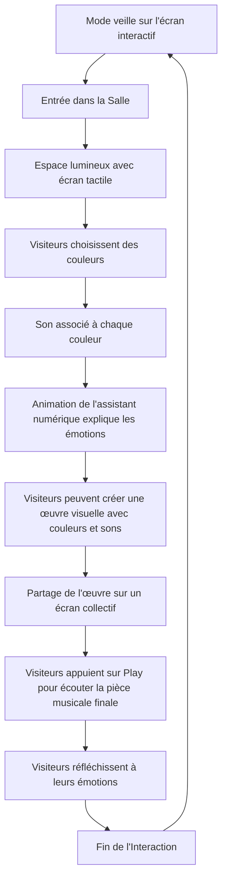
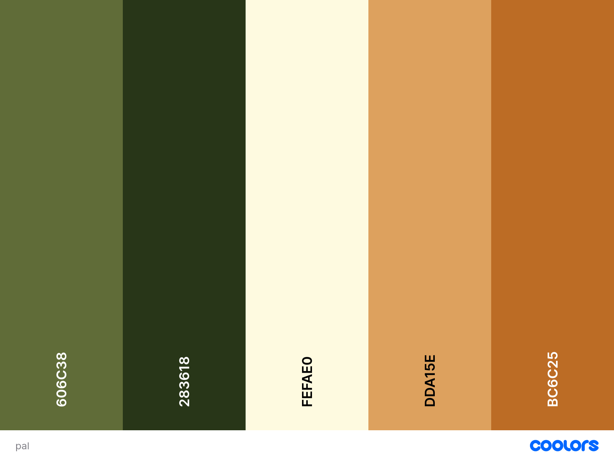
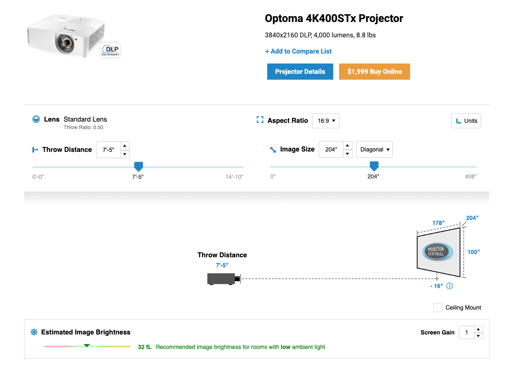

# La Symphonie des Couleurs

## Description
Une installation artistique interactive permettant aux visiteurs de créer des œuvres d'art sonores et visuelles en utilisant des couleurs et des sons.

## Idée
“La Symphonie des Couleurs” est une installation artistique interactive qui permet aux visiteurs de créer des œuvres d'art sonores et visuelles en utilisant des couleurs et des sons. Les participants interagissent avec un écran tactile pour sélectionner des couleurs, qui déclenchent des sons spécifiques, créant une expérience multisensorielle. Un assistant numérique, représenté par une simple animation, guide les visiteurs tout au long de l'expérience et les encourage à exprimer leurs émotions à travers l'art. À la fin de leur création, les utilisateurs peuvent appuyer sur un bouton "Play" pour écouter une pièce musicale finale qui suit le parcours des couleurs choisies.

## Concept
L'installation utilise des capteurs de couleur et des haut-parleurs pour transformer les choix des visiteurs en une composition visuelle et sonore. En touchant l'écran, les participants choisissent une couleur, ce qui génère une note musicale associée. L'assistant numérique explique comment chaque couleur et son peuvent influencer les émotions humaines, établissant un lien entre l'art, la science et l'expérience personnelle. En appuyant sur le bouton "Play", un lecteur musical défile de gauche à droite, intégrant toutes les couleurs sélectionnées pour former une pièce musicale finale.

## Objectifs
- **Expérientiels :** Offrir une expérience immersive où les visiteurs peuvent s’exprimer librement à travers la couleur et le son.
- **Émotionnels :** Sensibiliser sur l'impact des couleurs et des sons sur les émotions, favorisant une connexion personnelle avec l'art.
- **Éducatifs :** Expliquer les principes de base des couleurs et des sons, et leur influence sur l'humeur et la perception.

## Motivations
Cette installation cherche à rendre l'art accessible à tous en permettant aux participants de devenir eux-mêmes des artistes. En jouant sur les interactions simples, l'œuvre invite chacun à réfléchir à la façon dont les couleurs et les sons peuvent traduire des émotions.

## Espace Interactif

## Expérience Utilisateur

### Possibilités d'Exploration :
- Choisir différentes couleurs pour entendre des sons uniques.
- Observer l’impact émotionnel de chaque choix à travers l’animation.
- Créer une œuvre collective à partir des choix des visiteurs.
- Appuyer sur un bouton "Play" pour jouer les couleurs dessinées comme un séquenceur, intégrant toutes les couleurs sélectionnées dans une séquence musicale harmonisée.

## Ambiance

### Moodboard
- **Visuels :** Couleurs vibrantes, animations fluides, et motifs lumineux.
- **Son :** Échantillons sonores doux, mélodies inspirantes, et voix amicale de l'assistant.

### Palette de Couleurs

## Références Artistiques
- **Oeuvres :**
  - [Color Field Painting](https://www.moma.org/collection/works/78581?sov_referrer=art_term&art_term_slug=biomorphic)
  - [Sound Visualization](https://www.youtube.com/watch?v=JOltdbuXmM8)

- **Technologie :**
  - [FL Studio Sequencer](https://youtube.com/shorts/eRNYiPyqgMc?si=44y5ZhrqbM6yoWc9)

- **Sons :**
  - [Marcel Dettmann - Outback](https://www.youtube.com/watch?v=iNz0q6t5uM0)

# Devis 

## Fournis par l'Artiste
- **1 x Mac Mini M1 configuré**
- **1 x Interface tactile (écran 32" pour interactivité)**
- **1 x Contrôleur MIDI pour audio**
- **1 x Bras articulé pour écran**
- **1 x Câble Ethernet slim de 50'**
- **1 x Switch PoE**
- **1 x Adaptateur HDMI vers VGA (pour connectivité)**
- **2 x Impressions (177 x 118 cm)**

## Fournis par le Mois Multi

### Vidéo
- **Écran de projection :** 16’ x 9’
- **Projecteur :** Epson EH-TW9400 (pour une qualité d'image optimale)

### Audio
- **2 x Haut-parleurs (pour flexibilité et qualité sonore)**
- **1 x Caisson de basses actif**
- **1 x Amplificateur pour haut-parleurs passifs**
- **1 x Lot de câbles audio (XLR et RCA)**

### Éclairage
- **1 x Spot LED RGB sur zone interactive**
- **2 x Spots LED sur les impressions (pour un éclairage d'accentuation)**

## Accrochage
### Impressions
- Se référer aux spécifications d'accrochage.
- Les cadres doivent être de niveau et à distance égale de l'écran, à la même hauteur.

## Synoptique
- **1 x Installation interactive : La Symphonie des Couleurs**
- **Projection vidéo :** Éléments interactifs intégrant couleurs et sons
- **Stéréophonique**
- **2 x Impressions (177 x 118 cm)**

## Branchement

## Étude de Projection

##Plantation

### Logiciels
- **Projection :** Processing ou TouchDesigner pour l’animation.
- **Audio :** Ableton Live pour le son.
- **Animation :** Blender pour l'assistant numérique.
