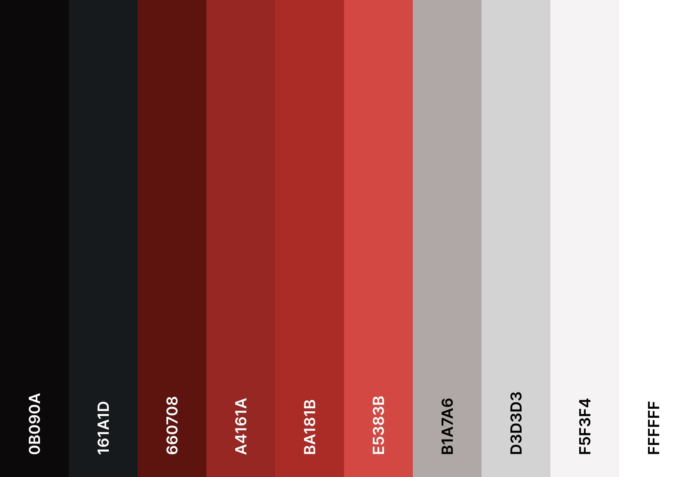

# La Symphonie des Couleurs

## Description
Une installation artistique interactive permettant aux visiteurs de créer des œuvres d'art sonores et visuelles en utilisant des couleurs et des sons.

## Idée
“La Symphonie des Couleurs” est une installation artistique interactive qui permet aux visiteurs de créer des œuvres d'art sonores et visuelles en utilisant des couleurs et des sons. Les participants interagissent avec un écran tactile pour sélectionner des couleurs, qui déclenchent des sons spécifiques, créant une expérience multisensorielle. Un assistant numérique, représenté par une simple animation, guide les visiteurs tout au long de l'expérience et les encourage à exprimer leurs émotions à travers l'art. À la fin de leur création, les utilisateurs peuvent appuyer sur un bouton "Play" pour écouter une pièce musicale finale qui suit le parcours des couleurs choisies.

## Concept
L'installation utilise des capteurs de couleur et des haut-parleurs pour transformer les choix des visiteurs en une composition visuelle et sonore. En touchant l'écran, les participants choisissent une couleur, ce qui génère une note musicale associée. L'assistant numérique explique comment chaque couleur et son peuvent influencer les émotions humaines, établissant un lien entre l'art, la science et l'expérience personnelle. En appuyant sur le bouton "Play", un lecteur musical défile de gauche à droite, intégrant toutes les couleurs sélectionnées pour former une pièce musicale finale.

## Objectifs
- **Expérientiels :** Offrir une expérience immersive où les visiteurs peuvent s’exprimer librement à travers la couleur et le son.
- **Émotionnels :** Sensibiliser sur l'impact des couleurs et des sons sur les émotions, favorisant une connexion personnelle avec l'art.
- **Éducatifs :** Expliquer les principes de base des couleurs et des sons, et leur influence sur l'humeur et la perception.

## Motivations
Cette installation cherche à rendre l'art accessible à tous en permettant aux participants de devenir eux-mêmes des artistes. En jouant sur les interactions simples, l'œuvre invite chacun à réfléchir à la façon dont les couleurs et les sons peuvent traduire des émotions.

## Espace Interactif

```mermaid

graph TD
    A[Mode veille sur l'écran interactif] --> B[Entrée dans la Salle]
    B --> C[Espace lumineux avec écran tactile]
    C --> D[Visiteurs choisissent des couleurs]
    D --> E[Son associé à chaque couleur]
    E --> F[Animation de l'assistant numérique explique les émotions]
    
    F --> G[Visiteurs peuvent créer une œuvre visuelle avec couleurs et sons]
    G --> H[Partage de l'œuvre sur un écran collectif]
    H --> I[Visiteurs appuient sur "Play" pour écouter la pièce musicale finale]
    
    I --> J[Visiteurs réfléchissent à leurs émotions]
    J --> K[Fin de l'Interaction]
    K --> A

```


## Expérience Utilisateur

### Possibilités d'Exploration :
- Choisir différentes couleurs pour entendre des sons uniques.
- Observer l’impact émotionnel de chaque choix à travers l’animation.
- Créer une œuvre collective à partir des choix des visiteurs.
- Appuyer sur un bouton "Play" pour écouter une pièce musicale finale intégrant toutes les couleurs sélectionnées.

## Ambiance

### Moodboard
- **Visuels :** Couleurs vibrantes, animations fluides, et motifs lumineux.
- **Son :** Échantillons sonores doux, mélodies inspirantes, et voix amicale de l'assistant.

### Palette de Couleurs


## Références Artistiques
- **Oeuvres :**
  - [Color Field Painting](https://www.moma.org/learn/moma_learning/themes/color-field-painting)
  - [Sound Visualization](https://youtu.be/4HbhjWx8L7s)
- **Films :**
  - [Fantasia](https://www.youtube.com/watch?v=KwF4s6d4h7U)

## Technologies

### Support Média
- **Audio :** Panneau de contrôle tactile, 1 haut-parleur à haute fidélité.
- **Vidéo :** Écran interactif projetant les œuvres créées.
- **Lumières :** LEDs programmables pour créer une ambiance dynamique.

### Matériel
- **Technologies interactives :** Écran tactile, haut-parleur, et câbles pour la connectivité.
- **Plateformes et outils :** Une table ou un support pour l'écran et le haut-parleur.

### Logiciels
- **Projection :** Processing ou TouchDesigner pour l’animation.
- **Audio :** Ableton Live pour le son.
- **Animation :** Blender pour l'assistant numérique.


